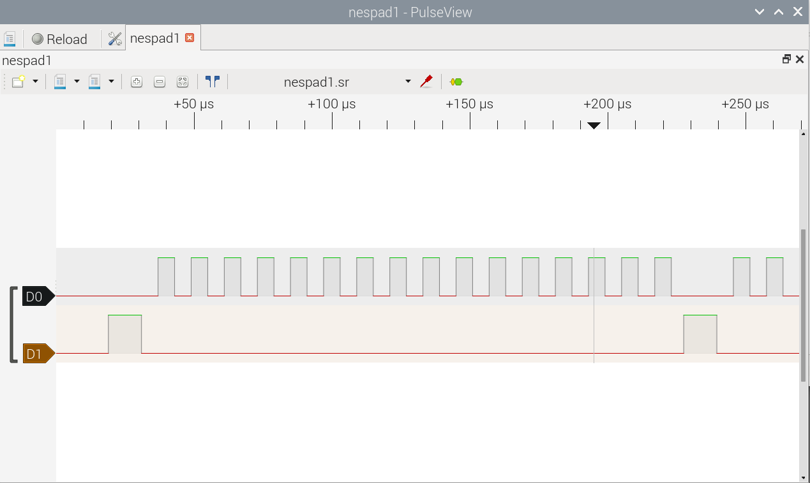

# pico-nespad
Pico PI NES joypad reader


Reads from dual NES joypads on a Pico PI.

## Example use
Basic flow:
```
  #include "nespad.h"

  ...

  nespad_default_init();
  uint32 joystate = nespad_state();
```

## Helper functions
There are some functions to help convert the return pad state to something useful.

General helper functions:
```
/**
 * Get the bit position of a button given the pad-state and button index
 */
uint32_t nespad_bitpos(
    const uint32_t nespad_pad, // The joypad index (0 or 1)
    const uint32_t nespad_bi   // One of NESPAD_BI_XXX
);

/**
 * Get the bit-mask for a button given the pad-state and button index
 */
uint32_t nespad_bitmask(
    const uint32_t nespad_pad, // The joypad index (0 or 1)
    const uint32_t nespad_bi   // One of NESPAD_BI_XXX
)

/**
 * Get a single button and return its state in a specific bit position
 */
uint32_t nespad_bit_shifted(
    const uint32_t nespad_state,
    const uint32_t nespad_pad, // The joypad index (0 or 1)
    const uint32_t nespad_bi,  // One of NESPAD_BI_XXX
    const uint32_t target_bp   // target bit position
)
```

Conversions for specific joysticks:
```
/**
 * Convert the joypad state to Kempston joystick state
 */
uint32_t nespad_to_kempston(
    const uint32_t nespad_state,
    const uint32_t nespad_pad // The joypad index (0 or 1)   
);

/**
 * Convert the joypad state to Kempston joystick state
 */
uint32_t nespad_to_sinclair_left(
    const uint32_t nespad_state,
    const uint32_t nespad_pad // The joypad index (0 or 1)   
);

/**
 * Convert the joypad state to Kempston joystick state
 */
uint32_t nespad_to_sinclair_right(
    const uint32_t nespad_state,
    const uint32_t nespad_pad // The joypad index (0 or 1)   
);
```

Build the sample app:
```
cd pico-nespad
cd pico-nespad/apps/
mkdir build
cd build
cmake -DPICO_SDK_PATH=~/pico/pico-sdk ..
make -j4
cp ./nespad_serial_test/nespad_serial_test.uf2 /media/neo/RPI-RP2/
```

Compile time symbols:
```
 * Symbol                   Default     Description
 * -----------------------------------------------------------------------------------
 * DEBUG_NESPAD                         Define this symbol for some debug to stdout
 * NESPAD_CLOCK_PERIOD_S    59e-6       NES joypad data clock period in seconds
 * NESPAD_PIO               pio0        Use PIO 0
 * NESPAD_SM                            PIO statemachine; undefined to pick a free one
 * NESPAD_IRQ               PIO0_IRQ_0  Use IRQ 0 for pio0
 * NESPAD_CLK_PIN_BASE      12          GPIO start for CLK and ENABLE
 * NESPAD_DATA_PIN_BASE     14          GPIO start for DATA1 and DATA2
```
## NES joypad pins


## Clocking scheme



## References
https://gamefaqs.gamespot.com/snes/916396-super-nintendo/faqs/5395<br/>
https://tresi.github.io/nes/<br/>
https://www.bertiusgames.com/projects/gamepad.html<br/>
https://github.com/xrip/pico-nes/tree/main/drivers/nespad<br/>
https://wokwi.com/projects/407394757834126337<br/>

